# Proyecto-4
 
 **0. Autores**
 
 * **Mateo Ramirez Hernandez**
 * **Juan Camilo Echeverri Salazar**
 * **Santiago Tello**

**1. Propuesta**

Se desea desarrollar un diferenciador de textos, mejor conocido como TextDiff.
TextDiff es una herramienta que permite identificar la diferencia entre dos archivos de texto.

**2. Algoritmo**

El algoritmo consiste en separar ambos textos en parrafos y recorrer cada parrafo del texto uno comparandolo contra cada parrafo del texto dos. esta comparacion se hace a traves de un algoritmo llamado LCS(largest common subsequence) y se almacena el porcentaje de similitud entre ambos parrafos en una un arreglo.

Cada parrafo del texto uno tiene un arreglo independiente donde cada posicion representa almacena el porcentaje de similitud con un parrafo del texto dos.

Debido a que cada texto es un arreglo de parrafos, el indice de cada parrafo del texto dos es el mismo indice de cada arreglo de porcentajes asociado a cada parrafo del texto 1.

**2.1 Paralelizacion**

Identificamos la oportunidad de optimizar el rendimiento de este algoritmo a traves de la paralelización, debido a sus componentes fuertemente acoplados a la hora de comparar un parrafo del texto 1 contra todos los del texto 2 se utilizara OpenMP debido a que cada parrafo del texto 2 que se compare contra el parrafo del texto 1 no depende de la comparacion obtenida en anteriores iteraciones, sin embargo existe un espacio de memoria compartida el cual es el arreglo donde se almacena el porcentaje de similitud.

Ademas de esto tambien existen elementos debilmente acoplados cuando se itera entre parrafos del texto 1, ya que estos son procesos completamente independientes entre ellos y no tiene una memoria compartida, sin emabargo es necesaria su sincronizacion a traves del paso de mensajes para poder analizar los resultados de cada parrafo como un conjunto que conforma el texto y poder tener el porcentaje de similitud total entre ambos textos.

**2.1.1 Ejecucion serial**

* Primero se compara el primer parrafo del texto 1 contra el primer parrafo del texto 2.
* luego se compara el primer parrafo del texto 1 contra el siguiente parrafo del texto 2, y asi hasta recorrer todos los parrafos del texto 2
* una vez se comparen todos los parrafos del texto 2, se pasa al siguiente parrafo del texto 1 y se vuelve a repetir el mismo proceso de comparacion contra todos los parrafos del texto 2 nuevamente.

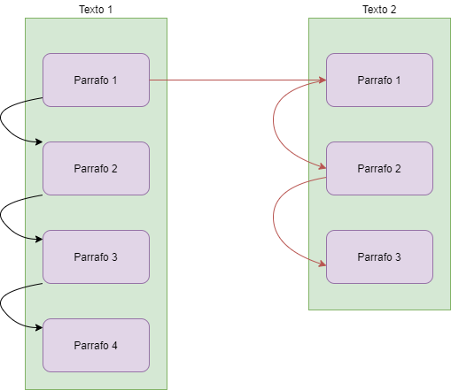

**2.1.2 Optimizacion OpenMP**

* Cuando se inicie el proceso de comparacion de un parrafo del texto 1 contra todos los parrafos del texto 2, este inicia multiples hilos a la vez(uno por cada parrafo del texto 2). 
* Cada hilo se encarga de comparar ambos parrafos y escribir el porcentaje de similitud en su respectiva posicion del arreglo.
* Como este arreglo es un espacio de memoria compartida entre todos los hilos ocasiona un problema de concurrencia y obtenemos un Data Race
* Es escencial poner especial atencion a este detalle y utilizar una de las estrategias aprendidas en el curso para evitar esta concurrencia.

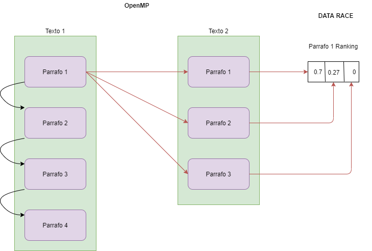

**2.1.3 Optimizacion MPI**

* Cada parrafo del texto 1 se inicializa en un proceso completamente independiente.
* Cada proceso inicializa multiples hilos a la vez para poder comparar contra todos los parrafos del texto 2 en paralelo.
* Al finalizar toda la comparacion contra el texto 2, el proceso se sincroniza con los demas a traves del paso de mensajes para poder enviar sus arreglo de porcentajes.

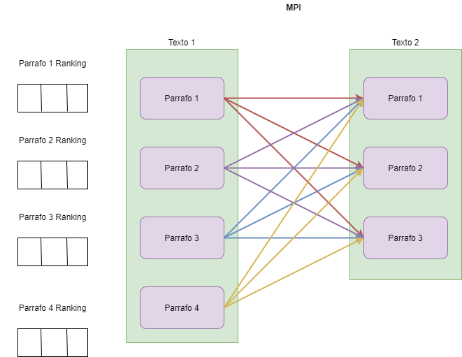

**3. Analísis** 

Lsc Algoritm, se trata de encontrar una subsecuencia  más larga que es común en un conjunto de secuencias (Aunque en la mayor parte solamente se toman dos secuencias). Es usado ampliamente para los sistemas de control de revisión como Git para reconciliar múltiples cambios sobre archivos controlados de revisión.

Para el caso de dos secuencias de n y m elementos, el tiempo de ejecución para la programación es de O(n × m)

**3.1 Analisis MP**
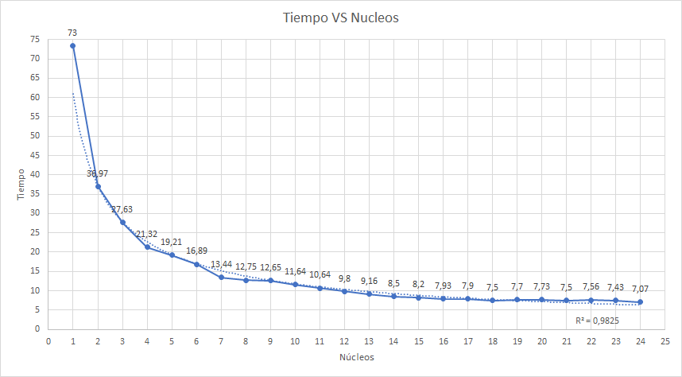

Se realizaron pruebas en el DCA para establecer tanto el speedup como la eficiencia del programa. Podemos apreciar que se tiene un tiempo máximo de 73 segundos al ejecutarse de manera serial y uno minimo de 7 segundos, con 24 núcleos.
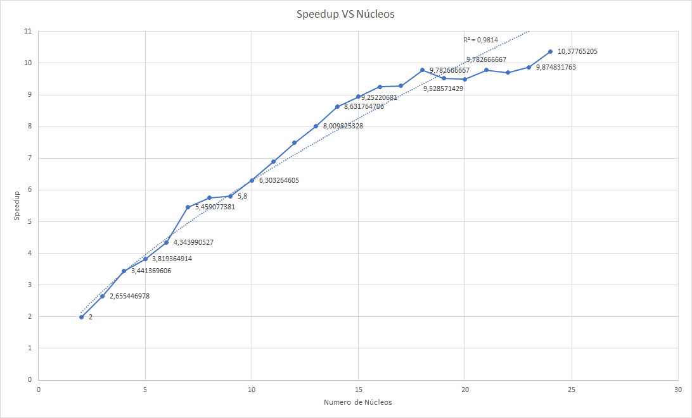

De acuerdo al diagrama de dispersión  de speedup vs núcleos, podemos observar que la eficiencia del programa se va reduciendo a medida que aumentan los núcleos.

**4. Ejecución**
```
python comparator.py
```

La salida del codigo nos mostrara un indice, el numero de coincidencias y el numero de diferencias.

* Ejecutando el codigo con un texto con 5000 lineas y el otro texto con 400 lineas el resultado es el siguiente:


* Tiempo de ejecución:


**4.1 Ejecución en paralelo**

Inicialmente se testeo el código en la máquina local, con 12 procesos.

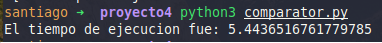

Luego, se ejecutó el código en el cluster del DCA, con diferentes cantidades de núcleos.
Inmediatamente notamos una diferencia en el tiempo de ejecución, ya que al ejecutarse con 24 procesos se demoraba 2 segundos más que localmente con 12.

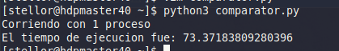

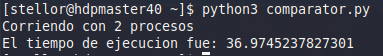

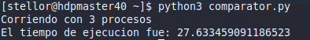

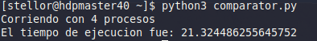

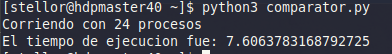


**5 Sustentaciones en video**
https://youtu.be/849W1WNmDrA
## Referencias

* [Tutorial LCS](https://www.geeksforgeeks.org/longest-common-subsequence-dp-4/)
* [Articulo original LCS](http://xmailserver.org/diff2.pdf)
